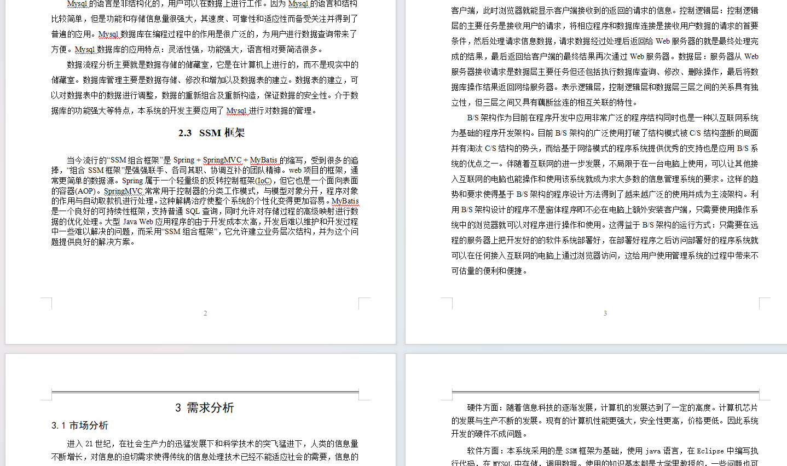
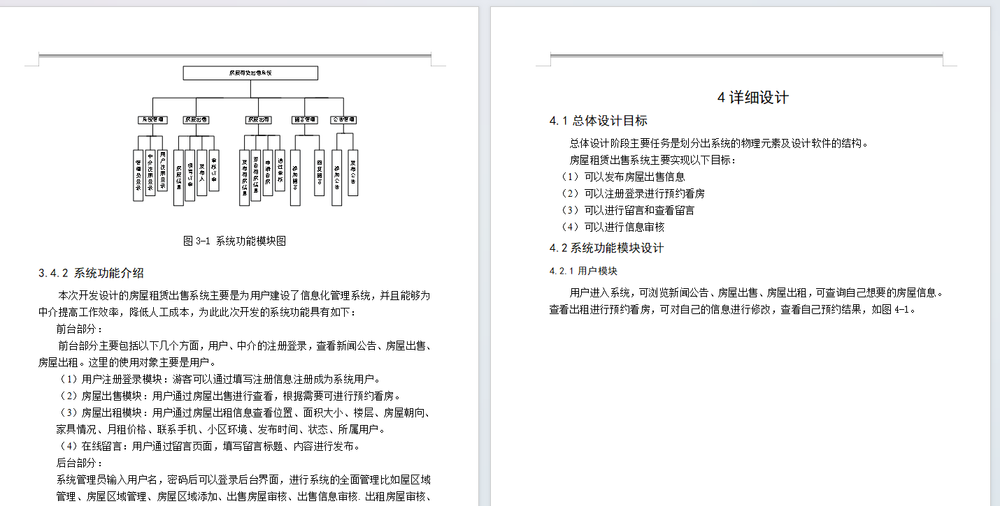
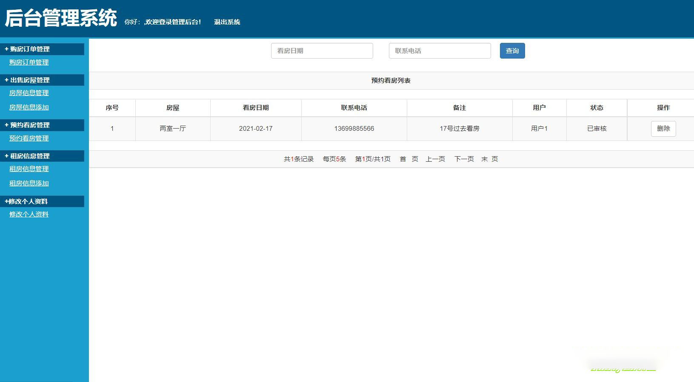
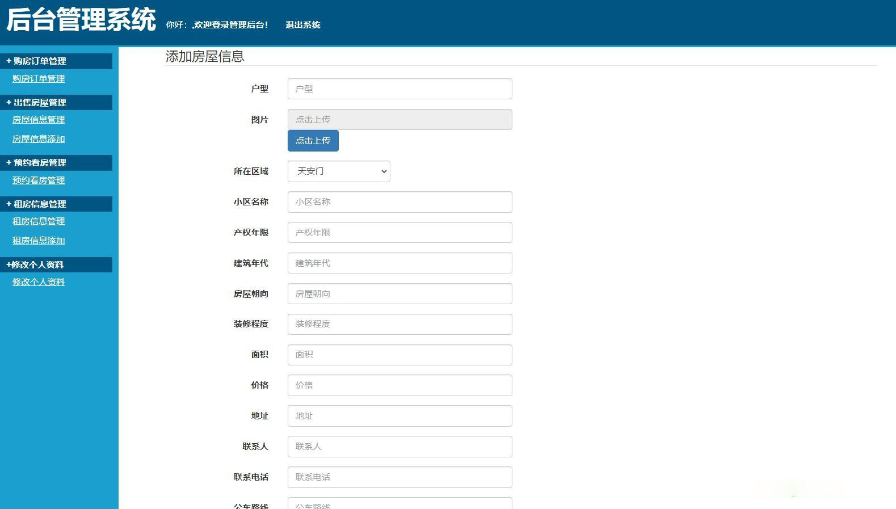
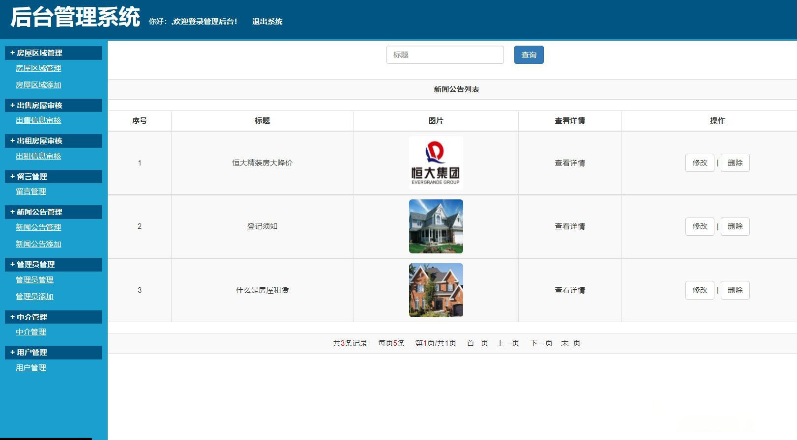

基于SSM的房屋出租租赁管理系统(程序+论文)
=
### 完整代码获取地址：从戎源码网 ([https://armycodes.com/](https://armycodes.com/))
### 作者微信：19941326836  QQ：952045282 
### 承接计算机毕业设计、Java毕业设计、Python毕业设计、深度学习、机器学习
### 选题+开题报告+任务书+程序定制+安装调试+论文+答辩ppt 一条龙服务
### 所有选题地址https://github.com/nature924/allProject

一、项目介绍
---
基于SSM框架的房屋出租租赁管理系统，系统分为用户，管理员，房屋中介三个角色：，主要功能如下

### 
用户功能：
（1）用户可以登录和注册系统
（2）用户可以查看系统的相关新闻和公告信息
（3）用户查看房屋的出售信息，可以在线订购房屋，输入订购的相关信息，生产订购单
（4）用户查看房屋的出租信息，可以在线预约看房
（5）用户可以发布在线留言信息
（6）用户修改个人资料信息
房屋中介：
（1）中介发布和管理房屋的出租信息，信息需要管理员审核
（2）中介发布和管理房屋的出售信息，信息需要管理员审核
（3）中介查看用户房屋购买的订单
（4）中介查看用户的预约看房的信息
（5）中介修改个人资料信息	
###
管理员：
（1）管理员登录系统后台
（2）管理员管理房屋的区域位置信息
（3）管理员对中介发布的出售和出租房屋信息进行审核
（4）管理员管理用户的留言信息进行管理
（5）管理员对网站新闻公告的信息进行管理
（6）管理员可以对添加别的管理员登录后台
（7）管理员对房屋中介账户信息进行管理
（8）管理员对系统注册的用户进行管理

二、项目技术
---
- 编程语言：Java
- 数据库：MySQL
- 项目管理工具：Maven
- 前端技术：JSP、HTML、Jquery、Layui、ECharts
- 后端技术：Spring、SpringMVC、MyBatis

三、运行环境
---
- 操作系统：Windows、macOS都可以
- JDK版本：JDK1.8以上都可以
- 开发工具：IDEA、Ecplise、Myecplise都可以
- 数据库: MySQL5.7以上都可以
- Tomcat：任意版本都可以
- Maven：任意版本都可以

四、运行截图
---
### 论文截图：

### 程序截图：

